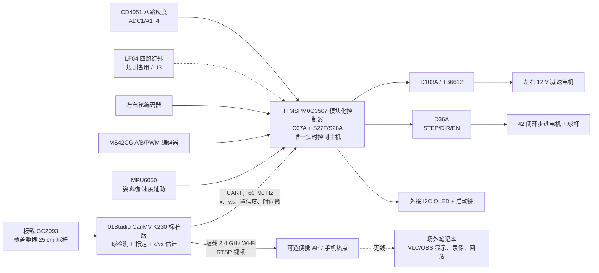
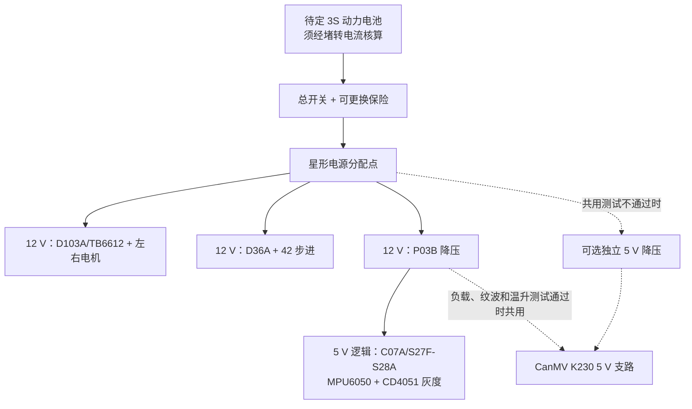

# 2026 H 题初版系统架构、硬件接线与验收门

> 版本：v0.6，2026-07-30
> 硬件事实以仓库根目录的 `硬件及接线清单.md` 为唯一来源；本文保留方案理由、
> 冲突分析和验收门，不要求每次编码前重新通读。
> 状态：模块化控制器和 D36A 型号已确认；最终视觉板冻结为拟购的
> 01Studio CanMV K230 标准版（建议 1 GB，标配 GC2093）。接口已到“可分模块开工”，
> 电平、有效极性、模块插接状态和峰值电流仍须在实物上逐线验收。
> 重要：当前仓库原有 `bsp/car_mspm0g3507.syscfg` 是旧通用小车模板，与已购
> C07A 模块化控制器、当前 TB6612、CD4051 八路灰度和闭环步进组件不匹配，
> **不得直接烧录上车**。

> **2026-07-30 当前实物覆盖说明：** 底盘实际使用 H9/H12 上的
> D103A/TB6612，不使用外接 D157B。架空实测确认 A 路
> `PB2 + PA14/PA13` 是物理左轮，B 路 `PB3 + PA16/PA17` 是物理右轮（2026-07-31 重测）；正逻辑命令
> 均为物理前进，编码器前进符号分别为左 `-1`、右 `+1`。CD4051 为实际模拟输入，
> 白底约 170 ADC、黑线 4095 ADC，R0..R7 从车体左到右。D36A 和
> MS42CG 在重新分配 TIMA1、PA13、PA14 前保持断开。

## 1. 赛题约束导出的设计原则

- 车体外廓不超过 35 cm × 25 cm，车轮驱动，电池随车。
- 循迹只使用光电模块；主传感器为 CD4051 八路灰度，K230 不参与赛道线识别。
- 车上必须有启动按键和计时显示，显示屏不大于 2 英寸。
- 25 cm 的 4 分 PPR 管和 1 cm 钢球构成球杆系统，管内不能增摩。
- 车载发送端需把整个杆和球的运动图像实时传到场外；场外完成接收、显示、
  存储和回放。
- 第 3 项要求静止车上完成 `O → +5 cm → -5 cm`；第 4～6 项把滚球控制和
  小车循迹叠加，球位置误差上限 1 cm。

因此首要原则是：**控制数据面与视频传输面逻辑隔离**。球检测和视频传输可以
共用 K230 与 GC2093，但 MSPM0 只接收带时戳、序号和 CRC 的球状态帧；RTSP
卡顿、录像或接收端故障不得进入控制闭环。

## 2. 总体架构



| 节点 | 只负责什么 | 明确不负责什么 |
|---|---|---|
| MSPM0G3507 | 八路灰度 ADC 采样、轮速、姿态采样、任务状态机、球位置外环、杆角内环、失效保护 | 图像处理、视频传输 |
| 01Studio CanMV K230 标准版 + 板载 GC2093 | 从同一相机管线测量 `x/vx/置信度` 并经 UART 发最新状态；同时输出 RTSP | 直接驱动任何执行器、赛道循迹 |
| 可选便携 AP/手机热点 + 场外笔记本 | 提供 2.4 GHz 局域网；显示、存储、回放 RTSP | 参与控制或给 MSPM0 下发实时指令 |

01Studio 官方参数列明标准版板载 2.4 GHz Wi-Fi，1 GB/2 GB LPDDR4 可选，
标配 GC2093，5 V @ 1 A，PCB 为 85 mm × 56 mm、31 g：
<https://wiki.01studio.cc/docs/canmv_k230/intro/canmv_k230/>。
1 GB 是本项目的成本优先起始选择，不是厂家对本任务的容量保证，最终以 2 小时
并行测试的峰值内存为准。固件冻结为 CanMV v1.8 发布页中的 01Studio 标准板
MicroSD 镜像（不是 EMMC 版）：
`CanMV_K230_01Studio_micropython_v1.8-0-gc2d1f5c_nncase_v2.11.0.img.gz`，
并用同页 `.md5` 校验：
<https://github.com/kendryte/canmv_k230/releases/tag/v1.8>。
CanMV v1.8 还提供无显示屏的 H.264/RTSP 和“AI + RTSP”两类参考：
<https://github.com/kendryte/canmv_k230/blob/v1.8/resources/examples/02-Media/rtsp_server.py>、
<https://github.com/kendryte/canmv_k230/blob/v1.8/resources/examples/02-Media/ai_rtsp.py>。

## 3. 已有硬件和资料审计

| 硬件/资料 | 当前结论 | 首版用途 |
|---|---|---|
| WHEELTEC TI MSPM0G3507 模块化控制器 | 已购；整套包含 C07A、S27F/S28A、P03B、MPU6050、D103A/TB6612、OLED 和蓝牙等插接模块 | C07A 为唯一主控；P03B、MPU6050、OLED、D103A/TB6612 保留，蓝牙拔下 |
| D157B 双 AT8236 驱动板 | 已购、当前不接入 | 不与板载 TB6612 并用 |
| 32 cm × 24 cm 三轮差速底盘、MG513XP28_12V | 已购；编码器线数、减速比、堵转电流待实测 | 小车底盘 |
| CD4051 八路灰度模块 | 已接入；5 V 供电，AD2/AD1/AD0=PA12/PA27/PB16，OUT=PB17 ADC；实测白约 170、黑 4095 ADC | 当前唯一主循迹，逐路 ADC 标定 |
| LF04 四路独立红外模块 | 已购；O1～O4 四路数字量，接 U3 四个 GPIO | 若现场明确不允许智能/灰度学习模块时备用 |
| 42 步进 + 编码器 + D36A + 球杆传动件 | 已确认 D36A；细分、EN 极性和电流仍须按实物登记 | 球杆闭环执行器 |
| 01Studio CanMV K230 标准版（1 GB 起步） | 拟购；图示套装含 70° GC2093、Type-C 线、4P 转接线、散热片、亚克力底板/铜柱螺丝、16 GB SD 和 Mini 读卡器 | 最终球位置视觉 + RTSP 图传；容量须压力测试 |
| 25 cm PPR 管、钢球、铰链、相机支架、椭圆赛道 | 已购/已有 | 机械样机和测试场 |
| 本地 WHEELTEC/2024H 例程 | 仅将其作为 CD4051 地址轮询和 ADC 采样的参考 | 不照抄旧主控引脚、阻塞时序或参数 |
| `又撞一天钟钢球开源` | MaixPy/Sipeed API，缺 `.mud` 模型，未发现许可证 | 数据与思路参考；不直接拷入交付工程 |
| `Ball-Balancing-PID-System` | MIT；PC + OpenCV + 舵机双轴平台 | 借鉴视觉/控制/串口/执行器解耦 |
| `PIDBallandBeam`、`ball_on_small_plate` | 未发现明确许可证或硬件差异大 | 只读参考，不复制源码 |

模块化控制器不是一块把所有功能焊死的 PCB。C07A 通过底板 H1/H2 插接；
P03B 跨接 H15/H16，MPU6050 插 H5，D103A/TB6612 跨接 H9/H12，蓝牙插 UART
模块座；OLED 的排针焊在 OLED 子板上并插入 C07A U5，再由螺钉固定。商品清单
注明“默认排针不焊”，首装前必须确认 C07A 两排针、各模块方向和母座实际焊接
状态。商品装配照可辨认各一块 P03B、MPU6050 和 D103A，但清单未逐项列名，
到货数量仍以实物为准。

当前尚缺或尚未确认：

1. 图示 01Studio CanMV K230 标准版套装，以及 K230 经可选 AP/手机热点到
   场外笔记本的接收录像链路；
2. 合适的动力电池、保险/总开关、电源分配，以及 P03B 实际负载能力和 K230
   是否需要独立 5 V 支路；
3. 电机编码器 CPR、减速比、左右相序和堵转电流；
4. S27F/S28A 具体板本、C07A V1.1 的 PB18/PB19 实际引出、D36A 细分/EN
   有效极性、CD4051 地址逻辑裕量与 OUT 电压上限，以及“视觉 + UART + RTSP”并行
   压力测试结果；
5. 所有模块装车后的实际外廓和重心。

## 4. 机械布置

- 球杆沿车身**纵向**、居中布置。这样椭圆弯道的主要横向向心加速度不会直接
  沿杆推动钢球；直线加减速可用前馈补偿。
- 铰链端固定在低位，步进传动端在另一端；球杆、步进电机和电池尽可能降低，
  相机立柱置于车身几何中心附近。
- GC2093 固定俯视整根 25 cm 球杆。控制 ROI 内让球杆占画面宽度的 75% 以上；
  同一帧的完整画面送 RTSP，裁切 ROI 只供球检测。无需第二颗图传摄像头。
- 标准版标配 70° GC2093，24P、默认接 CSI2。若把 70° 暂按水平视场粗算，
  完整覆盖 25 cm 至少需要约 18 cm 拍摄距离，实际还要以画面方向和畸变实测。
  首选官方 24P/15 cm 延长排线，让摄像头上置而 K230 主板低位固定；只有原配
  镜头无法同时满足整杆覆盖和钢球像素数时，才改用 CSI0 的 100° 手动调焦
  GC2093。官方摄像头、延长线和 CSI 说明：
  <https://wiki.01studio.cc/docs/canmv_k230/intro/module/>、
  <https://wiki.01studio.cc/docs/canmv_k230/machine_vision/camera/>。
- K230 标准版本身不安装显示屏；题目中的不大于 2 英寸显示要求由 C07A 板载
  OLED 作为小车计时显示来满足，和摄像机无关。
- CD4051 八路灰度位于车头下方、横向居中；安装高度以实测信噪比为准，并保证
  标定和比赛时高度一致。R0..R7 已通过遮挡确认从行驶方向左到右；标定白/黑值
  分别为 `174/4095,174/4095,172/4095,173/4095,171/4095,172/4095,171/4095,171/4095`。
- 32 cm × 24 cm 底盘距规则上限只剩纵向 3 cm、横向 1 cm。横向每侧仅
  5 mm 余量，任何支架、轮毂、线束和 PPR 管都计入外廓；装车第一天必须用
  35 cm × 25 cm 硬框实测，通不过就换窄底盘。

## 5. 首版引脚冻结表

以下分配采用当前 C07A TB6612、左右轮编码器和 CD4051 灰度模块的实测引脚。
PB6/PB7 已从旧 HiWonder 路线释放，但 Q2 不把它们自动分配给 K230。当前保留
MPU6050 和 D103A/TB6612，物理拔下蓝牙模块。

### 5.1 底盘与板载资源

| 功能 | MSPM0 引脚 | 电气/备注 |
|---|---|---|
| 左电机 A | PB2 + PA14/PA13 | TIMA1_CCP0=PWMA；AIN1/AIN2 定方向（2026-07-31 重测） |
| 右电机 B | PB3 + PA16/PA17 | TIMA1_CCP1=PWMB；BIN1/BIN2 定方向（2026-07-31 重测） |
| 左轮编码器 A/B | PA25 / PA26 | GPIO 中断软件正交计数 |
| 右轮编码器 A/B | PB20 / PB24 | GPIO 中断软件正交计数 |
| CD4051 AD2/AD1/AD0 | PA12 / PA27 / PB16 | U3 地址选择，000..111 对应 R0..R7 |
| CD4051 OUT | PB17 / ADC1_A1_4 | ADC 模拟输入；实测黑 4095、白约 170 |
| MPU6050 SCL/SDA/INT | PA1 / PA0 / PA7 | 与外接 OLED 共用 I2C0；PA7 只给 MPU6050 |
| LF04 O1/O2/O3/O4 | 不可用 | U3 已完全分配给 CD4051，不能同时插入 |
| 外接 OLED SCL/SDA | PA1 / PA0，I2C0 | 四针 SSD1306 兼容屏；默认 0x3C，VCC=3.3 V；原四线屏停用 |
| 启动键 BLS | PA18 | R8=47 kOhm 外部下拉；实测松开=0、按下=1；短按松手起跑、长按约 1 s 急停 |
| 板载 LED | PB9 | 状态/故障指示 |
| USB 调试 UART0 | PA10 TX / PA11 RX | 115200，保留 |
| SWD | PA19 / PA20 | 保留调试 |
| 5 ms 控制节拍 | TIMG7（无外部引脚） | TIMA1 已给 TB6612 双路 PWM；禁止沿用旧 BSP 的 TIMG6 tick |

外接 OLED 以地址 `0x3C` 与 MPU6050 (`0x68`) 共用 H5 的 `PA1/PA0`，其 VCC
必须从 3.3 V 取电，不能接 H5 的 5 V。H5 保留 `PA1/PA0/PA7` 给原装 MPU6050；
CD4051 通过 U3 的 `PA12/PA27/PB16/PB17` 扫描。PB6/PB7 保持释放，LF04 不得与
CD4051 共用 U3。

TB6612 每路使用一个 PWM 与两个方向输入：`IN1/IN2=00` 滑行，`01/10` 定方向，
`11` 短刹车。PB2/PB3 在当前 SysConfig 中锁为 `TIMA1_CCP0/1`，对应 A/右和
B/左；它们与 PA13/PA14 的方向脚冲突，因此 D36A/MS42CG 保持断开。

套装内 D103A 是一块带一颗 TB6612FNG 的双路模块，不是两块驱动板；它占用
`PB2/PB3、PA13/PA14、PA16/PA17`，是当前底盘驱动，不能拔下或用 D157B 替换。

### 5.2 球杆闭环步进（D36A 候选重映射，当前不接入）

| 信号 | MSPM0 端 | 对端 | 备注 |
|---|---|---|---|
| STEP | 当前未分配 | D36A ST1 | TB6612 已占 TIMA1，候选 PA24 仅供后续重新规划 |
| DIR | 当前未分配 | D36A DIR1 | TB6612 已占 PA13 |
| EN | 当前未分配 | D36A EN1 | 待重新分配与实测极性 |
| Encoder A | PB18 GPIO | MS42CG A | 软件正交；从 C07A V1.1 顶部扩展焊盘直接引线 |
| Encoder B | PB19 GPIO | MS42CG B | 软件正交；与 A 成对，需做双边沿中断和非法跳变统计 |
| Encoder PWM absolute | 当前未分配 | MS42CG PWM | TB6612 已占 PA14；当前不接入 |
| Encoder Z | 暂不接 | MS42CG Z | 首版非必要；保留测试焊盘 |
| Encoder VCC/GND | 3.3 V / GND | MS42CG VCC/GND | **严禁 5 V**，与主控共地 |
| D36A VIN/GND | 12 V 动力支路 | D36A | 动力回流走粗线 |

厂商 D36A 闭环例程原映射 `PA24/PA13/PA12 + PA1/PA0/PB20/PA25` 会撞
TB6612、CD4051/MPU6050 I²C 和左右轮编码器。当前不保留任何 D36A/MS42CG 的
正式引脚映射；PA13、PA14、PA24、PA22、PB18/PB19 都必须在独立例程和实物验收后
重新分配。S27F/S28A 上 PA14 同时连到 H12 的 TB6612 控制口，PA22 同时引到
CCD/J3-CN2；当前两处均不得接入 D36A/MS42CG。

PB18/PB19 是 C07A V1.1 新增引出，不经过 S27F/S28A 常规 H1/H2 资源区。
首装必须先确认主控确为 V1.1，并用万用表确认顶部 `B19/B18/B8` 扩展焊盘中
PB18/PB19 的连续性、逻辑电平和中断输入可用；编码器 GND 从另一个已确认的
主控 GND 点引出。若实物不是 V1.1，本表不能直接实施，须重新分配编码器 A/B。
软件正交首版同时读取 PA14 绝对角作交叉校验，出现非法跳变、累计角偏差或
脉冲超时立即降速并进入安全态。

保留 MPU6050 的 `PA1/PA0/PA7`。H5 底板座的供电与独立例程接线说明存在
5 V/3.3 V 表述差异，只允许插入套装匹配的带稳压模块；首次上电先测模块 VCC、
SCL/SDA 空闲电平和上拉去向，不得把裸 MPU6050 芯片直接接 5 V。

驱动已确定为 D36A；首次上电前登记实物默认细分和限流档位。改变拨码必须断电，
固件每转脉冲数必须同步。先不接电机，仅用示波器/逻辑分析仪验证
`STEP/DIR/EN`，再接 12 V 动力支路。

### 5.3 01Studio CanMV K230 单向状态串口

| 信号 | 01Studio CanMV K230 | MSPM0 | 备注 |
|---|---|---|---|
| 球状态 TX | UART2 TX / GPIO11 | PB7 / UART1_RX | 后续 115200 8N1 路线；与 Q2 的 U3 红外线路独立 |
| GND | GND | GND | 必须共地 |
| K230 RX / GPIO12 | 首版不接 | PB6 保留 | 首版目标点由 MSPM0 菜单决定 |
| UART 座 3.3 V / 5 V | **均不接** | — | K230 走供电树中的 5 V 支路；UART 只接 TX 和 GND |

PB6/PB7 与套装的插接式蓝牙模块共用；当前 Q2 改用 U3 的 PB16/PB17，因此不
占用 PB7。蓝牙模块无论哪种用途都要从底板 UART 模块座物理拔下，仅在软件中
禁用不够。
4P 座按板端丝印逐一核对
`GND / 3V3 / IO12-RX2 / IO11-TX2`，不得按转接线颜色猜信号。01Studio
官方资料给出 UART2 为 GPIO11 TX / GPIO12 RX，标准版可从
背面 4P 座引出，并要求双方是 3.3 V 电平、交叉接线和共地：
<https://wiki.01studio.cc/docs/canmv_k230/basic_examples/uart/>。
首次连接仍应用万用表/示波器确认 TX 空闲高电平约 3.3 V。

### 5.4 首版暂不接

- D157B、D36A、MS42CG：当前均不接入。D103A/TB6612 是唯一底盘驱动，必须保留
  在 H9/H12；D36A/MS42CG 与其 TIMA1、PA13、PA14 资源冲突。
- 插接式蓝牙：从模块座物理拔下；Q2 的 CD4051 使用 U3 的
  `PA12/PA27/PB16/PB17`，PB6/PB7 仅释放、不自动接 K230。
- CCD、雷达、超声波、舵机口：赛题不需要。

## 6. 供电树



- 动力支路和逻辑支路只在星形分配点汇接，电机/步进回流不穿过 K230 地线。
- P03B 插在 H15/H16，负责模块化控制器的 5 V 逻辑；其本地资料没有给出可信
  额定电流，不能凭商品标题假定 3 A 或 5 A。先分别测 C07A/OLED/MPU/CD4051 和
  K230 启动、视觉、推流时的电流，再做联合负载、纹波和温升测试。
- TB6612、D36A、P03B 和可能增加的独立降压入口分别放近端电解与 0.1 µF
  陶瓷去耦。D36A 当前断开；不得将任何额外 5 V 输出与 P03B 并联。
- K230 标准版官方额定供电为 5 V @ 1 A。若 P03B 在联合负载下仍有足够裕量、
  不引起主控复位且视频编码不掉帧，可从 P03B 单独分支供电；否则再增加独立
  5 V 降压。该决策以实测为准，不预设必须采购新模块。
- 台架首次启动可用套装 Type-C 线；正式装车冻结为经带锁止和应力释放的
  5 V 支路线束，接标准板 40Pin 中红色 5 V、黑色 GND。所谓“独立支路”是指
  K230 有自己的分支、保险/滤波和接插件，不等于必须另买一块降压。严禁误接
  3.3 V，也不得从 UART 4P 座的 3V3 给主板供电。官方供电说明：
  <https://wiki.01studio.cc/docs/canmv_k230/getting_start/power_supply/>。
- 电池容量、C 倍率和保险值不能凭商品标题决定；先测两轮堵转、步进锁止和
  K230 同时视觉+推流时的峰值电流，再按实测峰值留 30% 以上系统余量。

## 7. K230 无线图传

### 7.1 主方案：板载 Wi-Fi + RTSP

固定链路如下：

```text
板载 GC2093 → 单一 Sensor(id=2)
       ├─低分辨率 RGB/灰度通道 → 球检测 → UART2
       └─1280×720 YUV 通道 → 硬件 VENC H.264 → RTSP
       → 2.4 GHz Wi-Fi STA → 可选便携 AP / 手机热点
       → 场外笔记本 VLC/OBS → 实时显示 + 录像 + 立即回放
```

- 不依赖赛场公共 Wi-Fi。可使用已有手机热点或便携 AP 建立只服务 K230 和
  笔记本的 2.4 GHz 局域网；先用现有设备完成稳定性测试，不把专用路由器列为
  强制采购。
- 若 AP 支持 DHCP 地址保留则给 K230 固定租约；否则在本地配置中固定地址或
  由接收端发现当前地址。接收 URL 为 `rtsp://<K230_IP>:8554/test`。
- 首先跑无屏直连 VENC 的官方 `rtsp_server.py`，验证 1280×720 H.264、
  Wi-Fi、RTSP、VLC/OBS 显示和录像。
- `ai_rtsp.py` 只作为 AI 与 RTSP 并行的参考；它默认
  `display_mode="lcd"` 并通过显示回写推流，而图示套装不含 LCD，**不得原样
  作为无屏成品运行**。若试验 WBC 路线，须改为 `virt` 并显式匹配显示和
  `WBCRtsp` 尺寸。
- 最终优先采用一个 `Sensor(id=2)` 的多通道结构：低分辨率通道供球检测，
  YUV420SP 通道直绑 VENC/RTSP；不得创建第二个 Sensor，也不开 IDE 图像流。
- RTSP 失联只记录故障并允许视频任务重启；球状态 UART 必须继续按时发送。
  MSPM0 永远不等待网络。
- SSID/密码放 SD 卡本地配置文件，不提交仓库。

01Studio 官方资料确认板载陶瓷天线只支持 2.4 GHz，STA/AP 均可用：
<https://wiki.01studio.cc/docs/canmv_k230/network/wifi_connect/>。
当前官方 `ai_rtsp.py` 会在 Wi-Fi 连接后启动 `WBCRtsp`，输出
`rtsp://<IP>:8554/test`，但其中 1280 × 720 是 AI 输入尺寸，不等于 RTSP
输出尺寸。无屏 `rtsp_server.py` 才明确把 1280 × 720 YUV 通道绑定到
H.264 Main Profile 编码器：
<https://github.com/kendryte/canmv_k230/blob/v1.8/resources/examples/02-Media/rtsp_server.py>、
<https://github.com/kendryte/canmv_k230/blob/v1.8/resources/examples/02-Media/ai_rtsp.py>。

### 7.2 备份决策

目前**不采购第二套 FPV**。K230 到货后必须完成 2 小时“球检测 + UART +
RTSP + OBS 录像”联合压力测试。只有发生无法消除的持续掉流、视觉帧龄超限或
资源冲突时，才把独立数字/模拟 FPV 列为风险备份；它始终不得进入控制链。

## 8. K230 视觉链

1. 只裁切球杆窄 ROI，标定左右端点和中心，将像素映射为 `[-125,125] mm`。
2. 固定曝光/增益/白平衡并加漫射补光，降低钢球镜面高光漂移。
3. 主检测用背景差分/灰度阈值、面积、圆度和“必须位于管内”的约束；只在预测
   区域用 Hough 圆作回退。
4. 用 α-β 或 Kalman 估计 `x`、`vx`；串口只发最新状态，不排队发旧帧。
5. MSPM0 只接受序号更新、CRC 正确且置信度合格的帧；超过 120 ms 无有效帧，
   杆目标角缓慢回 0°、车辆减速并最终停车。

首版固定帧：

```text
AA 55 | type=10 | seq | t_ms:u32 | x_mm:i16 | vx_mm_s:i16
      | confidence:u8 | flags:u8 | crc16:u16 | 0D
```

代码入口：

- CanMV K230 球检测/UART 脚本：`k230/ball_tracker.py`
- K230 到货与 RTSP 合并步骤：`k230/README.md`
- MSPM0 协议解析：`firmware/h2026/ball_link.c`
- 球位置控制：`firmware/h2026/ball_balance.c`

截至 2026-07-29，CanMV 最新稳定版是 v1.8，UART 完整写入与未发送数据保留得到
改进：<https://github.com/kendryte/canmv_k230/releases/tag/v1.8>

## 9. 控制层级和安全边界

| 回路 | 建议频率 | 输入 | 输出 |
|---|---:|---|---|
| 左右轮速度 PI | 200 Hz | 轮编码器 | TB6612 A/B PWM + 方向输入 |
| 球杆角度闭环 | 200 Hz | 步进编码器 A/B + 绝对 PWM | STEP 频率/DIR（以实物为准） |
| CD4051 8CH 循迹 PD | 200 Hz | 八路 ADC 灰度帧 | 左右轮差速目标 |
| MPU6050 姿态辅助 | 100～200 Hz | 加速度/角速度 | 倾斜保护、状态记录；首版不直接替代轮速闭环 |
| 球位置 PV/PD | 60～100 Hz | K230 `x、vx` | 目标杆角 |
| 任务与保护 | 50～100 Hz | 时间、里程、链路健康 | 目标球位、车速、状态 |
| OLED | 10～20 Hz | 任务、时间、故障 | 小于 2 英寸板载显示 |

小角度初始模型：

```text
x_ddot ≈ (5/7) * (g * theta - a_car)
theta_cmd = Kp * (x_target - x) - Kd * vx + a_car_cmd / g
```

- 先把杆角限制在 ±3°～4°，稳定后再逐步放到 ±5°～6°。
- 初始量级可从 `Kp=0.6～0.9 rad/m`、`Kd=0.35～0.55 rad·s/m` 开始，
  但只能视作台架起点。
- 第 3 项的 `0 → +5 cm → -5 cm` 使用平滑 S 曲线目标。
- 积分首版关闭；确认静差来源后再加很小的积分和 anti-windup。
- 急停、K230 失联、编码器异常或超角度时，先让杆受控回水平，再关闭底盘和
  步进使能。

可借鉴但不能直接照搬：

- 2026 开源球杆项目：<https://github.com/AnesBenmerzoug/ball-and-beam>
- 机械回差、延迟、供电尖峰和积分饱和复盘：
  <https://anesbenmerzoug.github.io/posts/ball-and-beam/>
- MIT 模块化视觉/PI-D/串口/执行器工程：
  <https://github.com/giusenso/Ball-Balancing-PID-System>
- 步进电机减少换向死区、位置/角度串级控制思路：
  <https://mc.dfrobot.com.cn/thread-29023-1-1.html>

## 10. 必须先过的验收门

1. **法规/外形门**：外接 I²C OLED 用作启动计时显示；K230 不安装显示屏。
   整车穿过 35 cm × 25 cm 检查框。
2. **供电门**：分别测 P03B 逻辑负载、轮堵转、步进锁止和 K230 启动/推流
   峰值；比较 K230 共用 P03B 与独立 5 V 两种接法，无复位、无 5 V 跌落、
   无异常发热后才能冻结。
3. **底盘门**：架空开环确认左右电机/编码器符号，低速闭环直行，再接
   CD4051；逐地址扫描 `000..111`，逐通道确认 R0..R7 左右顺序、黑白 ADC
   标定和 5 ms 时序。LF04 只做规则备用验收。
4. **步进门**：D36A 先核对额定电源、3.3 V 编码器、细分、限流和 EN 安全态；
   先验证 PB18/PB19 软件正交与 PA14 绝对角一致，再做 ±2°、±6°，累计角与
   绝对 PWM 不得漂移。
5. **视觉门**：10 分钟连续输出，位置 RMS 噪声目标 <2 mm，丢帧后 120 ms
   内进入安全态。
6. **静态滚球门**：先 O 点稳定，再做 ±5 cm 平滑轨迹；稳定后才装行驶底盘。
7. **联合门**：车速从 0.2 m/s 开始，每次只提高 0.1 m/s；记录球误差、杆角、
   左右轮速和 K230 帧龄。
8. **图传门**：连续 2 小时同时运行球检测、UART、RTSP 和 OBS 录像；场外可
   实时显示、停止后立即回放，主动断开 RTSP 不影响 UART 帧龄和控制。

## 11. 当前五个硬阻塞

1. 图示 01Studio CanMV K230 标准版套装，以及经可选 AP/手机热点到笔记本的
   2.4 GHz 链路尚未上台架，因此无线图传目前只有官方资料依据。
2. 当前底盘横向余量只有 1 cm，装车后极易超宽。
3. 现有旧 SysConfig 和 BSP 引脚是通用模板，不是模块化控制器实物配置；需等
   S27F/S28A 板本、C07A V1.1 PB18/PB19 引出、电机 CPR/减速比/堵转电流
   核实后再生成正式 `syscfg`。
4. D36A 型号已确定，但实物细分、限流档、EN 有效电平和失能安全态尚未台架
   验证；PB18/PB19 软件正交的最高可靠转速也未验证。在完成低压逻辑检查前
   不得接动力电。
5. P03B 的可信持续负载能力、K230 是否可与逻辑共用 5 V、标配 GC2093 的
   实际视场和“视觉 + UART + RTSP + OBS”2 小时并行稳定性均未验证。
