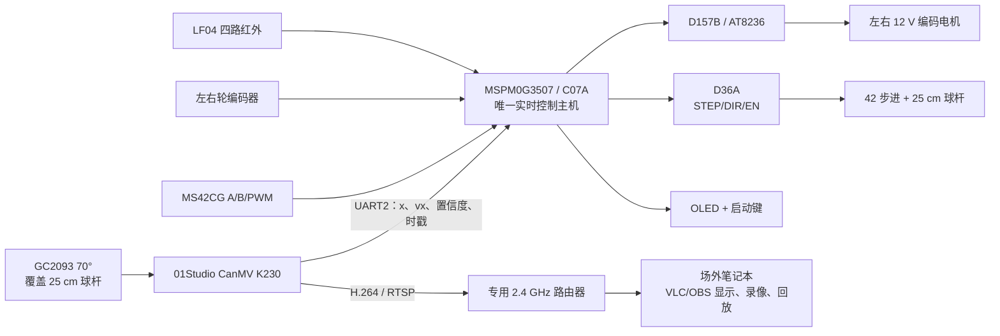
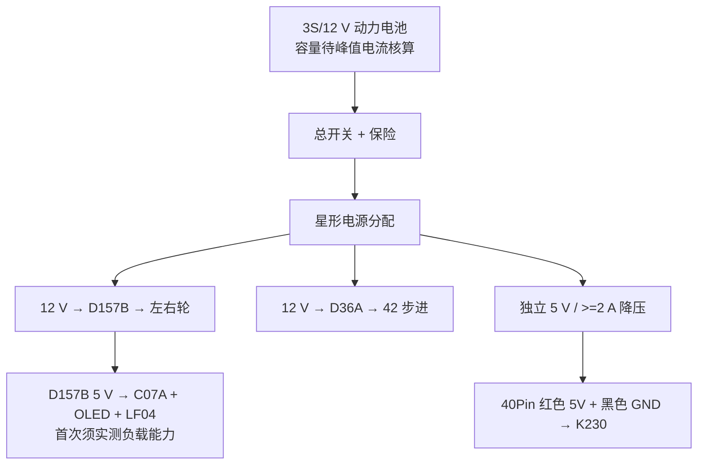

# ElectronicDesignContest2026

2026 年电子设计竞赛 H 题“车载平衡滚球运动控制系统”硬件工程。

> 当前阶段：架构与首版接线冻结，等待 01Studio CanMV K230 标准版和整车实物
> 联调。本文是仓库主入口；接线以本文和
> [`硬件及接线清单.md`](硬件及接线清单.md) 为准。

| 项目 | 当前冻结结果 |
|---|---|
| 实时主控 | WHEELTEC C07A / MSPM0G3507 |
| 底盘驱动 | D157B / 双 AT8236 + MG513XP28 12 V 编码电机 |
| 循迹 | LF04 四路红外，仅 MSPM0 使用 |
| 球杆执行器 | D36A + 42 步进电机 + MS42CG A/B/PWM 编码器 |
| 视觉与图传 | 01Studio CanMV K230 标准版 + 标配 GC2093 70° |
| 控制通信 | K230 UART2 单向发送球状态给 MSPM0 |
| 无线视频 | K230 硬件 H.264/RTSP + 自带 2.4 GHz 路由器 + 场外 OBS/VLC |
| 车载显示 | C07A 板载 OLED，用于启动计时和故障状态 |

## 系统架构



控制数据面和视频传输面逻辑隔离：MSPM0 永远不等待 RTSP。无线图传卡顿、
断开或录像失败不得进入控制闭环。

## 视觉与无线图传

<p align="center">
  
</p>

图示套装包括 CanMV K230 标准板、板上 GC2093、Type-C 线、
XH-1.25 转 2.54 mm 四线、散热片、亚克力底板和铜柱螺丝、16 GB MicroSD
及 Mini 读卡器。产品图来自 01Studio，原图由项目成员提供。

标配摄像头为 GC2093、70°、24P。若把 70° 暂按水平视场估算，覆盖 25 cm
球杆至少需要约 18 cm 拍摄距离；装车优先使用官方 24P/15 cm 延长排线，让
摄像头上置、K230 主板低位固定。

最终 K230 媒体结构：

```text
GC2093 / Sensor(id=2)
  ├─低分辨率 RGB/灰度通道 → 球检测 → UART2 → MSPM0
  └─1280×720 YUV420SP → 硬件 H.264 VENC → RTSP
       → K230 板载 2.4 GHz Wi-Fi STA
       → 专用路由器 → 场外 VLC/OBS
```

固件冻结为 CanMV v1.8 的 01Studio 标准板非 eMMC 镜像：

```text
CanMV_K230_01Studio_micropython_v1.8-0-gc2d1f5c_nncase_v2.11.0.img.gz
```

无屏首测使用官方 `rtsp_server.py`。`ai_rtsp.py` 默认
`display_mode="lcd"`，套装不含 LCD，不能原样作为成品运行。

## 硬件清单

| 硬件 | 状态 | 首版用途 |
|---|---|---|
| C07A（MSPM0G3507）+ S28A | 已购 | 唯一实时控制主机 |
| D157B 双 AT8236 | 已购 | 左右轮驱动 |
| 32 cm × 24 cm 三轮底盘 | 已购 | 机械底盘；横向仅余 1 cm 合规空间 |
| MG513XP28 12 V 编码电机 ×2 | 已购 | 左右轮闭环 |
| LF04 四路红外 | 已购 | 唯一循迹传感器 |
| D36A | **型号已确定** | 球杆 STEP/DIR/EN 驱动 |
| 42 步进 + MS42CG 编码器 | 已购 | 球杆角度闭环 |
| 25 cm PPR 管、钢球、铰链和传动件 | 已有/已购 | 球杆机械系统 |
| 01Studio CanMV K230 标准版 1 GB 套装 | 拟购 | 球检测与 RTSP；容量须压力测试 |
| 正点原子 K230D BOX | 已购 | 仅作算法台架和备用 |
| 独立 5 V/≥2 A 降压 | 待备 | 专供 K230 |
| 专用 2.4 GHz 路由器 | 待备 | K230 与场外笔记本局域网 |
| MPU6050 | 已购 | 首版不接，PA0/PA1 已给步进编码器 |

完整 BOM 状态和限制见 [硬件及接线清单](硬件及接线清单.md)。

## 供电



- 台架首次点亮 K230 可用 Type-C；正式装车使用带锁止和应力释放的 5 V/GND
  线束。
- K230 要求严格 5 V；不得从 UART 4P 座的 3V3 给主板供电。
- 所有信号必须共地，电机/步进动力回流不得穿过 K230 或 C07A 地线。
- 电池、保险和线径按轮堵转、步进锁止及 K230 推流峰值核算，并留至少 30%
  余量。

## 关键接线

### 底盘、循迹和人机接口

| 功能 | MSPM0 引脚/资源 | 对端与限制 |
|---|---|---|
| 左电机 AIN1/AIN2 | PB2 / PB3，TIMG6_CCP0/1 | D157B；禁止照搬旧 TIMA1 配置 |
| 右电机 BIN1/BIN2 | PA8 / PA9，TIMA0 两通道 | D157B |
| 左轮编码器 A/B | PA25 / PA26 | GPIO 中断软件正交 |
| 右轮编码器 A/B | PB20 / PB24 | GPIO 中断软件正交 |
| LF04 O1/O2/O3/O4 | PA27 / PA12 / PB16 / PB17 | 3.3 V 数字输入 |
| OLED SCL/SDA/RST/DC | PA28 / PA31 / PB14 / PB15 | C07A 板载 OLED |
| 启动键 BLS | PA18 | 消抖；长按急停 |
| 状态 LED | PB9 | 运行/故障指示 |
| 5 ms 控制节拍 | TIMG7 | TIMG6 已给左电机 |
| USB 调试 UART0 | PA10 TX / PA11 RX | 115200 |
| SWD | PA19 / PA20 | 下载和调试 |

### D36A 与球杆编码器

| 信号 | MSPM0 端 | 对端 | 注意 |
|---|---|---|---|
| STEP | PA24 / TIMA1_CCP1 | D36A ST1 | 硬件脉冲 |
| DIR | PA13 GPIO | D36A DIR1 | 首次低速确认方向 |
| EN | PA22 GPIO | D36A EN1 | 外部上/下拉保证 MCU 复位时失能 |
| Encoder A | PA1 / TIMG8_CCP0 | MS42CG A | 硬件 QEI |
| Encoder B | PA0 / TIMG8_CCP1 | MS42CG B | 硬件 QEI |
| Encoder PWM | PA14 / TIMG12_CCP0 | MS42CG PWM | 双边沿捕获和断线超时 |
| Encoder Z | 暂不接 | MS42CG Z | 首版非必要 |
| Encoder VCC/GND | 3.3 V / GND | VCC/GND | **严禁 5 V** |

PA14 同时连到 S28A H12/TB6612 插座，PA22 同时引到 CCD/J3-CN2；首版必须
让这些接口保持空置或电气隔离。

### K230 到 MSPM0

| CanMV K230 | C07A/MSPM0 | 说明 |
|---|---|---|
| UART2 TX / GPIO11 | PB7 / UART1_RX | 球状态，115200 8N1 |
| GND | GND | 必须共地 |
| UART2 RX / GPIO12 | 首版不接 | 单向传输 |
| 3V3 | 不接 | 不并联两板电源 |

K230 背面 4P 座按板端丝印核对：
`GND / 3V3 / IO12-RX2 / IO11-TX2`，不得根据转接线颜色猜信号。PB7 与 C07A
板载蓝牙共用，接 K230 前必须物理断开蓝牙 TX。

## 机械冻结

- 整车外廓必须通过 35 cm × 25 cm 检查框。
- 32 cm × 24 cm 底盘横向每侧只有约 5 mm 余量，支架、轮毂和线束全部计入。
- 球杆沿车身纵向、居中布置，降低弯道横向加速度沿杆推动钢球的影响。
- 电池、K230 和步进电机尽量低位安装；仅摄像头上置。
- C07A OLED 是小车启动计时显示；K230 不安装显示屏。

## 上电与联调顺序

1. 检查所有电源支路、极性、保险和共地，动力支路先断开。
2. 点亮 C07A、OLED 和 LF04，确认启动键与 5 ms TIMG7 节拍。
3. 架空验证 D157B 四输入、左右电机方向和编码器符号。
4. 不接步进动力，用示波器确认 D36A `STEP/DIR/EN` 和复位失能状态。
5. 接 3.3 V 编码器，验证 QEI 和绝对 PWM 后再低速接入步进电机。
6. K230 先跑摄像头、UART2，再跑无屏 H.264/RTSP。
7. 静止台架完成球的 `0 → +5 cm → -5 cm`，再装车低速循迹。
8. 最终连续两小时运行球检测、UART、H.264/RTSP 和 OBS 录像。

## 软件与验证状态

| 验证项 | 当前结果 |
|---|---|
| Python `ball_tracker.py` 语法检查 | PASS |
| 原通用小车 PC 仿真 6 项 | PASS |
| H1 球状态帧、CRC 和超时 | PASS |
| H2 LF04 四路译码 | PASS |
| H3 球位置外环模型 | PASS，最终误差约 0.2 mm |
| 真车 D157B/D36A/K230 联调 | 待实物 |

当前代码入口：

- [MSPM0 H 题模块](NUEDC2026_Car/firmware/h2026/)
- [K230 球检测与到货流程](NUEDC2026_Car/k230/)
- [PC 仿真](NUEDC2026_Car/sim/)
- [详细架构、冲突和验收门](NUEDC2026_Car/docs/H2026_ARCHITECTURE.md)

## 仓库结构

```text
ElectronicDesignContest2026/
├─ README.md                         项目主入口
├─ 硬件及接线清单.md                完整 BOM、供电和接线表
├─ docs/assets/                      README 使用的项目图片
├─ NUEDC2026_Car/
│  ├─ firmware/                      MSPM0 固件与 H 题模块
│  ├─ k230/                          K230 视觉、UART 和到货流程
│  ├─ sim/                           PC 回归仿真
│  └─ docs/                          架构、协议和调参文档
├─ .gitignore                        排除本机环境、原始资料和生成物
└─ .gitattributes                    文本与二进制属性
```

CCS 本机工作区、题目原文、采购表与截图、厂商资料副本、第三方参考工程、
旧方案、`tmp/`、编译产物和本地工具状态均不提交。所用器件与开源资料通过
README/文档中的型号、用途和原始链接追溯。

## 当前未解除的硬件风险

1. 01Studio K230 标准版尚未到台架，无线图传目前只有官方资料依据。
2. D36A 的细分、限流、EN 有效极性和复位失能仍须实测。
3. S28A 实物版本、电机 CPR/减速比/堵转电流尚未登记。
4. 标配 GC2093 的实际钢球像素数、视场和安装高度尚未验证。
5. 24 cm 底盘装车后存在超宽风险。

## 官方资料

- [01Studio CanMV K230 教程目录](https://wiki.01studio.cc/docs/canmv_k230/)
- [CanMV K230 标准版参数](https://wiki.01studio.cc/docs/canmv_k230/intro/canmv_k230/)
- [GC2093 与延长排线](https://wiki.01studio.cc/docs/canmv_k230/intro/module/)
- [UART2 GPIO11/GPIO12](https://wiki.01studio.cc/docs/canmv_k230/basic_examples/uart/)
- [K230 供电方式](https://wiki.01studio.cc/docs/canmv_k230/getting_start/power_supply/)
- [CanMV v1.8 发布与 01Studio 镜像](https://github.com/kendryte/canmv_k230/releases/tag/v1.8)
- [无屏 H.264/RTSP 示例](https://github.com/kendryte/canmv_k230/blob/v1.8/resources/examples/02-Media/rtsp_server.py)
- [01Studio K230 资源入口](https://github.com/01studio-lab/K230_Resource)

## 资料与发布边界

本仓库当前为私人硬件开发仓库。第三方厂商资料和参考工程各自保留原许可证；
在公开发布前必须重新检查许可证、个人路径、采购截图和所有生成物。
